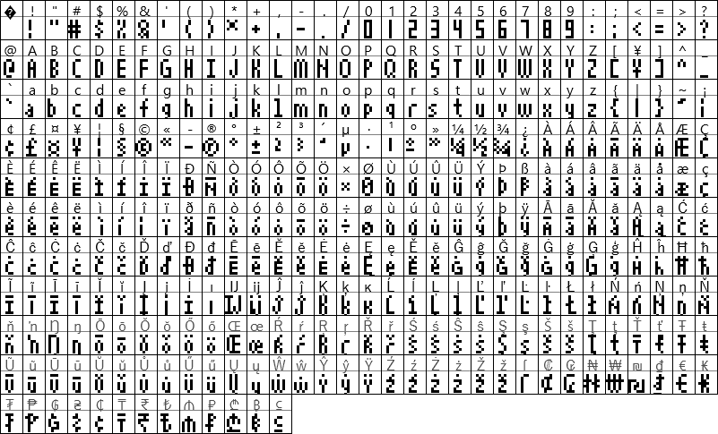

# MatrixClock Fonts
Fonts to be used with LED Matrix Clocks

## About these fonts
These fonts are designed strictly with LED Matrix Clocks in mind, especially a unit that uses [EsphoMaTrix](https://github.com/lubeda/EsphoMaTrix/). They are BDF Fonts, so they can be directly implemented with ESPHome (and perhaps Arduino).

Because BDF fonts are bitmap fonts, the size of these fonts is pixel-fixed. They are not resizable like TTF fonts.

Most characters will be 3 pixels wide, but certain characters like G and M and & are wider. Punctuation characters are generally 1 or 2 pixels wide.  All characters have 1 empty column on the right side... except the space itself, which is only 1 column wide. This should help when you need a bit of space between characters but don't want to lose 4-5 columns of pixels while doing so!

Fonts will be added as I continue work on this project.

### Using these fonts
The code to use a BDF font in ESPHome is a lot simpler than using a TTF font, since glyph-mapping is un-needed. Your xoffset & yoffset should probably be left at default as well.
```
font: 
  - file: ehmtx/MatrixClock-LightLetters6.bdf
    id: ehmtx_font
```

## 6-Series Fonts
Suitable when using a weekday band underneath the time on an 8-row matrix

Sorry to the European languages but accents on letters only 5 pixels tall are nearly impossible to recognize anyway... I'll convert these to at least include the encoding in the near future, even if those chracters don't actually have any accents in the glyph itself.

### MatrixClock-Chunky6
Everything big and blocky


[Download](./6-series/MatrixClock-Chunky6.bsd)

### MatrixClock-LightLetters6
Most characters have been lightened a bit but the numbers are still chunky


[Download](./6-series/MatrixClock-LightLetters6.bsd)

### MatrixClock-Light6
The numbers have been shaved and stylized


[Download](./6-series/MatrixClock-Light6.bsd)

## 8-Series Fonts
Suitable when using the full height of an 8-row matrix - contains the entire Latin Supplement and Extended characters and a bunch of currency characters

When using EsphoMaTrix, check that this is in your yaml:
```
ehmtx:
  show_dow: false
  yoffset: 8
```

### MatrixClock-Chunky8
Everything big and blocky


[Download](./8-series/MatrixClock-Chunky8.bsd)

### MatrixClock-LightLetters8
Most characters have been lightened a bit but the numbers are still chunky



[Download](./8-series/MatrixClock-LightLetters8.bsd)

### MatrixClock-Light8
The numbers have been shaved and stylized


[Download](./8-series/MatrixClock-Light8.bsd)

## Authorship
```
** The original 3x5 font is licensed under the 3-clause BSD license:
**
** Copyright 1999 Brian J. Swetland
** Copyright 1999 Vassilii Khachaturov
** Portions (of vt100.c/vt100.h) copyright Dan Marks
**
** All rights reserved.
**
** Redistribution and use in source and binary forms, with or without
** modification, are permitted provided that the following conditions
** are met:
** 1. Redistributions of source code must retain the above copyright
**    notice, this list of conditions, and the following disclaimer.
** 2. Redistributions in binary form must reproduce the above copyright
**    notice, this list of conditions, and the following disclaimer in the
**    documentation and/or other materials provided with the distribution.
** 3. The name of the authors may not be used to endorse or promote products
**    derived from this software without specific prior written permission.
**
** THIS SOFTWARE IS PROVIDED BY THE AUTHOR ``AS IS'' AND ANY EXPRESS OR
** IMPLIED WARRANTIES, INCLUDING, BUT NOT LIMITED TO, THE IMPLIED WARRANTIES
** OF MERCHANTABILITY AND FITNESS FOR A PARTICULAR PURPOSE ARE DISCLAIMED.
** IN NO EVENT SHALL THE AUTHOR BE LIABLE FOR ANY DIRECT, INDIRECT,
** INCIDENTAL, SPECIAL, EXEMPLARY, OR CONSEQUENTIAL DAMAGES (INCLUDING, BUT
** NOT LIMITED TO, PROCUREMENT OF SUBSTITUTE GOODS OR SERVICES; LOSS OF USE,
** DATA, OR PROFITS; OR BUSINESS INTERRUPTION) HOWEVER CAUSED AND ON ANY
** THEORY OF LIABILITY, WHETHER IN CONTRACT, STRICT LIABILITY, OR TORT
** (INCLUDING NEGLIGENCE OR OTHERWISE) ARISING IN ANY WAY OUT OF THE USE OF
** THIS SOFTWARE, EVEN IF ADVISED OF THE POSSIBILITY OF SUCH DAMAGE.
```
Modifications to Tom Thumb for improved readability are from Robey Pointer, see this page for the BDF file which I used as a base:  http://robey.lag.net/2010/01/23/tiny-monospace-font.html

The original author does not have any objection to relicensing of Robey Pointer's modifications (in this file) in a more permissive license.  See the discussion at the above blog, and also here: http://opengameart.org/forumtopic/how-to-submit-art-using-the-3-clause-bsd-license

As such, these fonts are released under the CC-BY License: https://creativecommons.org/licenses/by/4.0/
