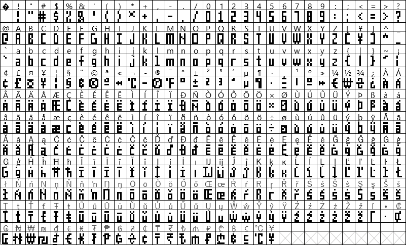
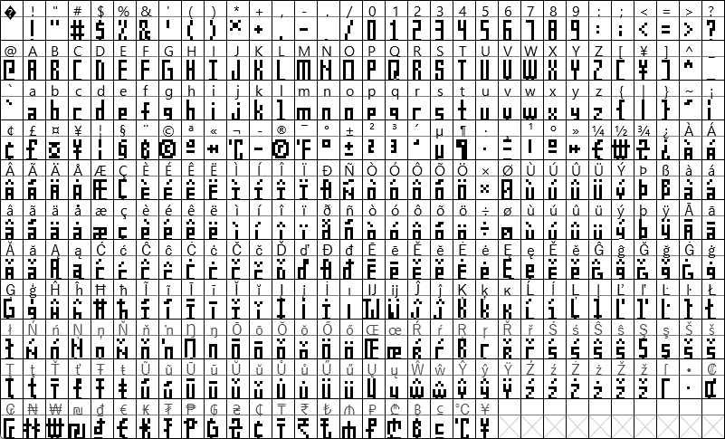
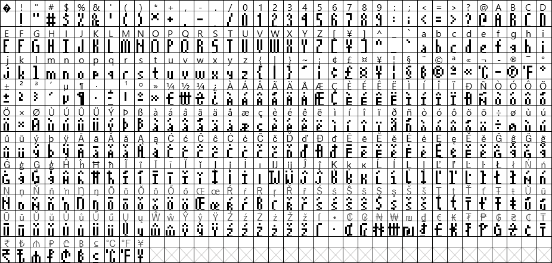
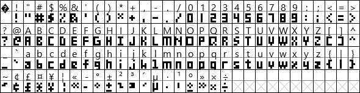
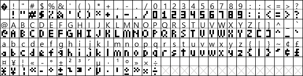
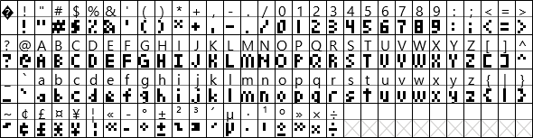

# MatrixClock Fonts
Fonts to be used with LED Matrix Clocks

## About these fonts
These fonts are designed strictly with LED Matrix Clocks in mind, especially a unit that uses [EsphoMaTrixv2](https://github.com/lubeda/EspHoMaTriXv2/). They are BDF Fonts, so they can be directly implemented with ESPHome (and perhaps Arduino).

Because BDF fonts are bitmap fonts, the size of these fonts is pixel-fixed. They are not resizable like TTF fonts. This is a good thing.

Most characters will be 3 pixels wide, but certain characters like G and M and & are wider. Punctuation characters are generally 1 or 2 pixels wide.  All characters have 1 empty column on the right side... except the space itself, which is only 1 column wide. This should help when you need a bit of space between characters but don't want to lose 4-5 columns of pixels while doing so!

Fonts will be added as I continue work on this project.

### Using these fonts
To reduce the space that the font takes up during the compile please use code as such:
```
font: 
  - file: ehmtx/MatrixClock-LightLetters6.bdf
    id: ehmtx_font
    glyphs:  |
      ! "#$%&'()*+,-./0123456789:;<=>?@ABCDEFGHIJKLMNOPQRSTUVWXYZ[\]^_`abcdefghijklmnopqrstuvwxyz°
```

Add any needed characters from this:
```
{|}~¡¢£¤¥¦§¨©ª«¬®¯±²³´µ¶·¸¹º»¼½¾¿ÀÁÂÃÄÅÆÇÈÉÊËÌÍÎÏÐÑÒÓÔÕÖ×ØÙÚÛÜÝÞßàáâãäåæçèéêëìíîïðñòóôõö÷øùúûüýþÿ
```
#### Extra characters
Any characters included in the glyphs list that are not actually in the font will cause ESPHome to error when compiling. This appears to be a flaw in Pillow, a python dependency that converts fonts. The version of Pillow included with ESPHome 2023.7.0 (and earlier) interprets all BDF fonts as being in the Latin-1 codepage. Any attempts I made to force it into recognizing other encoding (like UTF-8) failed. The full unicode BDF files are still in the files, if you wish to also give it an attempt.  That said, there appears to be a fix in the dev version so support for Unicode should be coming...

Because of this flaw, I made a few "useless" characters look like something else. You can use these special characters in Home Assistant:
```
¨ → Bitcoin
¸ → Ethereum
¬ → Degree C
¯ → Degree F
¼ → Euro
½ → Won
¾ → Hryvnia
```

## 8-Series Fonts
Suitable when using the full height of an 8-row matrix - contains the entire Latin-1 character set and a bunch of currency characters

When using EsphoMaTrix, check that this is in your yaml (probably):
```
ehmtx:
  show_dow: false
  yoffset: 8
```

### MatrixClock-Chunky8
Everything big and blocky



[Download](https://powernukkit.github.io/DownGit/index.html#/home?directFile=1&url=https://github.com/darkpoet78/MatrixClockFonts/blob/main/8-series/MatrixClock-Chunky8.bdf)

### MatrixClock-Chunky8X
Instead of tails, the characters will take up the full 8 pixels


[Download](https://powernukkit.github.io/DownGit/index.html#/home?directFile=1&url=https://github.com/darkpoet78/MatrixClockFonts/blob/main/8-series/MatrixClock-Chunky8X.bdf)

### MatrixClock-Light8
Most characters have been lightened and shaved a bit


[Download](https://powernukkit.github.io/DownGit/index.html#/home?directFile=1&url=https://github.com/darkpoet78/MatrixClockFonts/blob/main/8-series/MatrixClock-Light8.bdf)

### MatrixClock-Light8X
The characters will take up the full 8 pixels - this one looks really good on info screens



[Download](https://powernukkit.github.io/DownGit/index.html#/home?directFile=1&url=https://github.com/darkpoet78/MatrixClockFonts/blob/main/8-series/MatrixClock-Light8X.bdf)

## 6-Series Fonts
Suitable when using a weekday band underneath the time on an 8-row matrix

Sorry to the European languages but accents on letters only 5 pixels tall are terrible. These are pretty much only useful for displaying the time and having the weekdays underneath.

For now, the included characters match what are in the thumbnails. Many have been omitted.

### MatrixClock-Chunky6
Everything big and blocky



[Download](https://powernukkit.github.io/DownGit/index.html#/home?directFile=1&url=https://github.com/darkpoet78/MatrixClockFonts/blob/main/6-series/MatrixClock-Chunky6.bdf)

### MatrixClock-LightLetters6
Most characters have been lightened a bit but the numbers are still chunky



[Download](https://powernukkit.github.io/DownGit/index.html#/home?directFile=1&url=https://github.com/darkpoet78/MatrixClockFonts/blob/main/6-series/MatrixClock-LightLetters6.bdf)

### MatrixClock-Light6
The numbers have been shaved and stylized



[Download](https://powernukkit.github.io/DownGit/index.html#/home?directFile=1&url=https://github.com/darkpoet78/MatrixClockFonts/blob/main/6-series/MatrixClock-Light6.bdf)

## EspHoMaTriXv2 & 2 Fonts

Here are some snippets to show how to use a 6-series font to display the time and an 8-series font to display other screens.
```
font:
  - file: ehmtx/MatrixClock-Chunky6.bdf
    id: special_font
    #size: 16
    glyphs:  |
      ! "#$%&'()*+,-./0123456789:APMTapmt
  - file: ehmtx/MatrixClock-Light8.bdf
    id: default_font
    #size: 16
    glyphs:  |
      ! "#$%&'()*+,-./0123456789:;<=>?@ABCDEFGHIJKLMNOPQRSTUVWXYZ[\]^_`abcdefghijklmnopqrstuvwxyz°
```
Font offsets are needed to make sure the font (especially the 8-series) displays correctly.
```
ehmtxv2:
  show_seconds: false
  default_font_id: default_font
  default_font_yoffset: 8
  special_font_id: special_font
  special_font_yoffset: 6
```

## Authorship

### The following notice applies to the 6-series fonts

```
** The original 3x5 font is licensed under the 3-clause BSD license:
**
** Copyright 1999 Brian J. Swetland
** Copyright 1999 Vassilii Khachaturov
** Portions (of vt100.c/vt100.h) copyright Dan Marks
**
** All rights reserved.
**
** Redistribution and use in source and binary forms, with or without
** modification, are permitted provided that the following conditions
** are met:
** 1. Redistributions of source code must retain the above copyright
**    notice, this list of conditions, and the following disclaimer.
** 2. Redistributions in binary form must reproduce the above copyright
**    notice, this list of conditions, and the following disclaimer in the
**    documentation and/or other materials provided with the distribution.
** 3. The name of the authors may not be used to endorse or promote products
**    derived from this software without specific prior written permission.
**
** THIS SOFTWARE IS PROVIDED BY THE AUTHOR ``AS IS'' AND ANY EXPRESS OR
** IMPLIED WARRANTIES, INCLUDING, BUT NOT LIMITED TO, THE IMPLIED WARRANTIES
** OF MERCHANTABILITY AND FITNESS FOR A PARTICULAR PURPOSE ARE DISCLAIMED.
** IN NO EVENT SHALL THE AUTHOR BE LIABLE FOR ANY DIRECT, INDIRECT,
** INCIDENTAL, SPECIAL, EXEMPLARY, OR CONSEQUENTIAL DAMAGES (INCLUDING, BUT
** NOT LIMITED TO, PROCUREMENT OF SUBSTITUTE GOODS OR SERVICES; LOSS OF USE,
** DATA, OR PROFITS; OR BUSINESS INTERRUPTION) HOWEVER CAUSED AND ON ANY
** THEORY OF LIABILITY, WHETHER IN CONTRACT, STRICT LIABILITY, OR TORT
** (INCLUDING NEGLIGENCE OR OTHERWISE) ARISING IN ANY WAY OUT OF THE USE OF
** THIS SOFTWARE, EVEN IF ADVISED OF THE POSSIBILITY OF SUCH DAMAGE.
```
Modifications to Tom Thumb for improved readability are from Robey Pointer, see this page for the BDF file which I used as a base:  http://robey.lag.net/2010/01/23/tiny-monospace-font.html

The original author does not have any objection to relicensing of Robey Pointer's modifications (in this file) in a more permissive license.  See the discussion at the above blog, and also here: http://opengameart.org/forumtopic/how-to-submit-art-using-the-3-clause-bsd-license

### The following notice applies to all fonts

All of these fonts are released under the CC-BY License: https://creativecommons.org/licenses/by/4.0/
