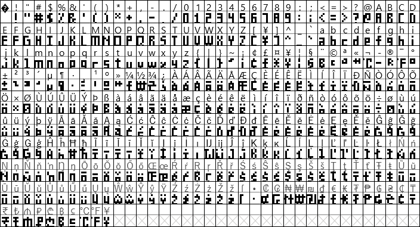
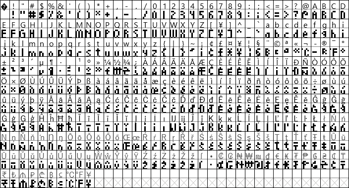

# MatrixClock Fonts
Fonts to be used with LED Matrix Clocks

## About these fonts
These fonts are designed strictly with LED Matrix Clocks in mind, especially a unit that uses [`EspHoMaTriXv2`](https://github.com/lubeda/EspHoMaTriXv2/). They are BDF Fonts, so they can be directly implemented with ESPHome (and perhaps Arduino).

Because BDF fonts are bitmap fonts, the size of these fonts is pixel-fixed. They are not resizable like TTF fonts. This is a good thing.

Most characters will be 3 pixels wide, but certain characters like G and M and & are wider. Punctuation characters are generally 1 or 2 pixels wide.  All characters have 1 empty column on the right side... except the space itself, which is only 1 column wide. This should help when you need a bit of space between characters but don't want to lose 4-5 columns of pixels while doing so!

Fonts will be added as I continue work on this project.

### Using these fonts
To reduce the space that the font takes up during the compile please use code as such:
```
font: 
  - file: ehmtx/MatrixClock-Light6.bdf
    id: ehmtx_font
    glyphs:  |
      ! "#$%&'()*+,-./0123456789:;<=>?@ABCDEFGHIJKLMNOPQRSTUVWXYZ[\]^_`abcdefghijklmnopqrstuvwxyz°
```

Add any needed characters from this:
```
{|}~¡¢£¤¥¦§¨©ª«¬®¯±²³´µ¶·¸¹º»¼½¾¿ÀÁÂÃÄÅÆÇÈÉÊËÌÍÎÏÐÑÒÓÔÕÖ×ØÙÚÛÜÝÞßàáâãäåæçèéêëìíîïðñòóôõö÷øùúûüýþÿ
```
#### Extra characters
Any characters included in the glyphs list that are not actually in the font will cause ESPHome to error when compiling. Also, certain characters in the font cannot be used by ESPHome and will cause the same error when compiling. This appears to be a flaw in Pillow, a python dependency that converts fonts. The version of Pillow included with ESPHome 2023.7.0 (and earlier) interprets all BDF fonts as being in the Latin-1 codepage. Any attempts I made to force it into recognizing other encoding (like UTF-8) failed. The full unicode BDF files are still in the files, if you wish to also give it an attempt.  That said, there appears to be a fix in the dev version so support for Unicode should be coming...

Because of this flaw, I made a few "useless" characters look like something else. You can use these special characters in Home Assistant:
```
¨ → Bitcoin
¸ → Ethereum
¬ → Degree C
¯ → Degree F
¼ → Euro
½ → Won
¾ → Hryvnia
```

## 8-Series Fonts
Suitable when using the full height of an 8-row matrix - contains the entire Latin-1 character set and a bunch of currency characters

When using EspHoMaTriX, check that this is in your yaml (probably):
```
ehmtx:
  show_dow: false
  yoffset: 8
```

### MatrixClock-Chunky8
Everything big and blocky


[Download](https://powernukkit.github.io/DownGit/index.html#/home?directFile=1&url=https://github.com/darkpoet78/MatrixClockFonts/blob/main/8-series/MatrixClock-Chunky8.bdf)

### MatrixClock-Chunky8X
The bottom row of pixels is usally reserved for tails but here every character has been stretched out to use that row - this one is my personal favorite!


[Download](https://powernukkit.github.io/DownGit/index.html#/home?directFile=1&url=https://github.com/darkpoet78/MatrixClockFonts/blob/main/8-series/MatrixClock-Chunky8X.bdf)

### MatrixClock-Light8
Most characters have been lightened and shaved a bit


[Download](https://powernukkit.github.io/DownGit/index.html#/home?directFile=1&url=https://github.com/darkpoet78/MatrixClockFonts/blob/main/8-series/MatrixClock-Light8.bdf)

### MatrixClock-Light8X
All Characters will take up the full 8 rows of pixels - this one looks really good on info screens!


[Download](https://powernukkit.github.io/DownGit/index.html#/home?directFile=1&url=https://github.com/darkpoet78/MatrixClockFonts/blob/main/8-series/MatrixClock-Light8X.bdf)

## 6-Series Fonts
Suitable when using a weekday band underneath the time on an 8-row matrix

I've updated the font files to contain the same characters as the 8-series but accents on letters only 5 or 6 pixels tall are mostly terrible.

### MatrixClock-Chunky6
Everything big and blocky


[Download](https://powernukkit.github.io/DownGit/index.html#/home?directFile=1&url=https://github.com/darkpoet78/MatrixClockFonts/blob/main/6-series/MatrixClock-Chunky6.bdf)

### MatrixClock-Chunky6X
Instead of tails, the characters will take up a full 6 rows of pixels



[Download](https://powernukkit.github.io/DownGit/index.html#/home?directFile=1&url=https://github.com/darkpoet78/MatrixClockFonts/blob/main/6-series/MatrixClock-Chunky6X.bdf)

### MatrixClock-Light6
The numbers have been shaved and stylized


[Download](https://powernukkit.github.io/DownGit/index.html#/home?directFile=1&url=https://github.com/darkpoet78/MatrixClockFonts/blob/main/6-series/MatrixClock-Light6.bdf)

### MatrixClock-Light6X
Full 6 rows of pixels



[Download](https://powernukkit.github.io/DownGit/index.html#/home?directFile=1&url=https://github.com/darkpoet78/MatrixClockFonts/blob/main/6-series/MatrixClock-Light6X.bdf)

## Regarding the '1' character:

In the Chunky fonts, all numbers are the same width but it is possible to use a narrow-width '1'.  Instructions are below.

### Chunky8

If you want the narrow '1' , edit the Chunky8.bdf file with a text editor and find 'STARTCHAR one' and replace the entry with:
````
STARTCHAR one
ENCODING 49
SWIDTH 250 0
DWIDTH 2 0
BBX 1 7 0 0
BITMAP
80
80
80
80
80
80
80
ENDCHAR
````
### Chunky8X

If you want the narrow '1' , edit the Chunky8X.bdf file with a text editor and find 'STARTCHAR one' and replace the entry with:
````
STARTCHAR one
ENCODING 49
SWIDTH 250 0
DWIDTH 2 0
BBX 1 8 0 -1
BITMAP
80
80
80
80
80
80
80
80
ENDCHAR
````
### Replacing other characters

Notice the pattern above?  A lot of characters can be swapped between files in this way!  Prefer the Light letters but chunky numbers?  Use  text editor and replace the entries!

## EspHoMaTriXv2 Fonts

Here are some snippets to show how to use a 6-series font to display the time and an 8-series font to display other screens.
```
font:
  - file: ehmtx/MatrixClock-Chunky6.bdf
    id: special_font
    #size: 16
    glyphs:  |
      ! "#$%&'()*+,-./0123456789:APMTapmt
  - file: ehmtx/MatrixClock-Light8.bdf
    id: default_font
    #size: 16
    glyphs:  |
      ! "#$%&'()*+,-./0123456789:;<=>?@ABCDEFGHIJKLMNOPQRSTUVWXYZ[\]^_`abcdefghijklmnopqrstuvwxyz°
```
Font offsets are needed to make sure the font (especially the 8-series) displays correctly.
```
ehmtxv2:
  show_seconds: false
  default_font_id: default_font
  default_font_yoffset: 8
  special_font_id: special_font
  special_font_yoffset: 6
```

## Editing or Contributing

Check out FontForge: https://fontforge.org/en-US/

## An older fixed-width BDF font which served as initial inspiration:

At first, I used Tom Thumb as a base. There may be still be some resemblance but pretty sure that's just because there's only so much you can do with such limited pixels.  Nevertheless, if you're interested, you can check out that font here: https://robey.lag.net/2010/01/23/tiny-monospace-font.html