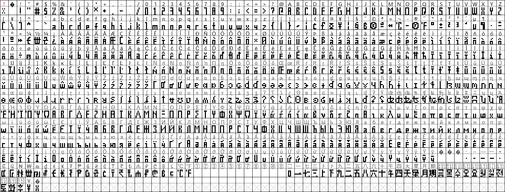
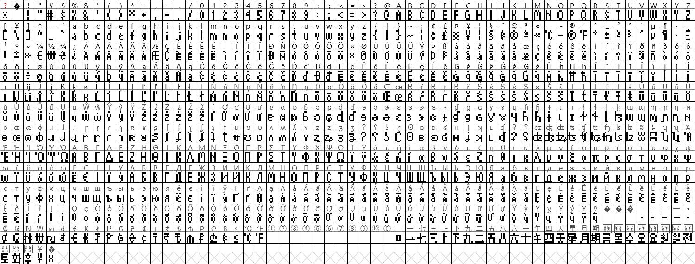
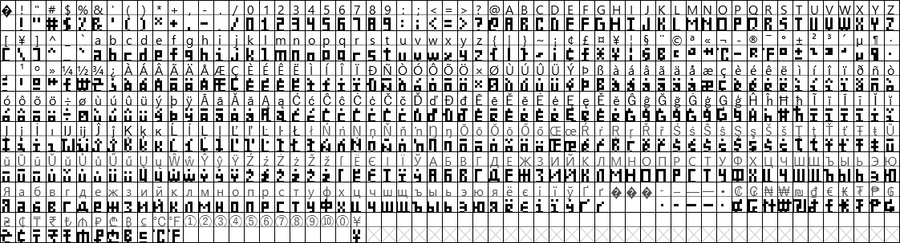
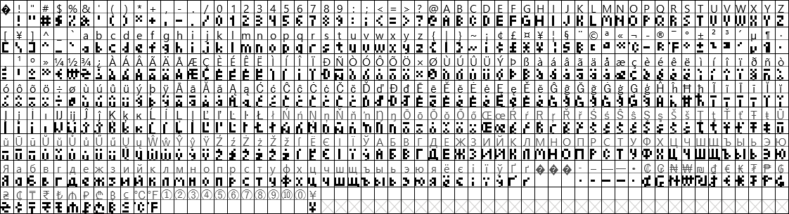

# Matrix Fonts
Fonts to be used with LED Matrix Clocks and other LED Matrix projects

## About these fonts
These fonts are designed with LED Matrix Clocks in mind, especially a unit that uses [`EspHoMaTriXv2`](https://github.com/lubeda/EspHoMaTriXv2/) or [`EspHome-Led-PixelClock`](https://github.com/trip5/EspHome-Led-PixelClock/). They are BDF and TTF Fonts, so they can be directly implemented with ESPHome (and perhaps Arduino).

Because these are bitmap fonts, the size of these fonts is pixel-fixed. They are not resizable. This is a good thing.

Most characters will be 3 pixels wide, but certain characters like G and M and & are wider. Punctuation characters are generally 1 or 2 pixels wide.  All characters have 1 empty column on the right side... except the space itself, which is only 1 column wide. This should help when you need a bit of space between characters but don't want to lose 4-5 columns of pixels while doing so!

I will continue adding characters to fonts as I have time. If you wish your language to be a priority, open an issue and I'll see what I can do.

### Using these fonts
To reduce the space that the font takes up during the compile please use code as such:
```
font: 
  - file: ehmtx/MatrixLight6.bdf
    id: ehmtx_font
    glyphs:  |
      ! "#$%&'()*+,-./0123456789:;<=>?@ABCDEFGHIJKLMNOPQRSTUVWXYZ[\]^_`abcdefghijklmnopqrstuvwxyz°
```

Add any needed characters from this (this list seems valid for BDF files):
```
{|}~¡¢£¤¥¦§¨©ª«¬®¯±²³´µ¶·¸¹º»¼½¾¿ÀÁÂÃÄÅÆÇÈÉÊËÌÍÎÏÐÑÒÓÔÕÖ×ØÙÚÛÜÝÞßàáâãäåæçèéêëìíîïðñòóôõö÷øùúûüýþÿ
```
Of course, you can also add characters not in the above list but visible in the graphics below.

### Characters
Any characters included in the glyphs list that are not actually in the font will cause ESPHome to error when compiling.

Also note that there is a limit of 256 characters that can be used. This is a hard limit set by Pillow, a python dependency that converts fonts to bitmaps usable by ESPHome. If your glyphs list is longer, any characters beyond that limit will simply not be displayed.

### Unicode Characters
```
UnicodeEncodeError: 'latin-1' codec can't encode character '\u0416' in position 0: ordinal not in range(256)
``````

This error has to do with the way that Pillow interprets a BDF font file as being in the Latin-1 codepage if the character list doesn't match what it expects. Since that part of Pillow is quite old, there seems to be no interest in fixing it to match UTF standards. So, if you wish to use Unicode characters, you must use a TTF file instead.

These TTF files are not usable by Windows, since they include only bitmaps. They are also not very useful when editing the font. So the BDF files will always be considered as master files.


### Character Substitutions
Because of the BDF-Pillow flaw, I made a few "useless" characters look like something else. You can still use a BDF file if you use these special characters in the glyphs list and in Home Assistant:
```
¨ → Bitcoin
¸ → Ethereum
¬ → Degree C
¯ → Degree F
¼ → Euro
½ → Won
¾ → Hryvnia
```


## 8-Series Fonts
Suitable when using the full height of an 8-row matrix - contains the entire Latin-1 character set and a bunch of currency characters

When using EspHoMaTriX, check that this is in your yaml (probably):
```
ehmtx:
  show_dow: false
  yoffset: 8
```

### MatrixChunky8
Everything big and blocky


[ [BDF Download](https://powernukkit.github.io/DownGit/index.html#/home?directFile=1&url=https://github.com/trip5/Matrix-Fonts/blob/main/8-series/MatrixChunky8.bdf) | 
[TTF Download](https://powernukkit.github.io/DownGit/index.html#/home?directFile=1&url=https://github.com/trip5/Matrix-Fonts/blob/main/8-series/MatrixChunky8.ttf) ]

### MatrixChunky8X
Below the baseline is usually reserved for tails but with the 'X' fonts, there is no baseline - everything takes up the full 8 rows of pixels



[ [BDF Download](https://powernukkit.github.io/DownGit/index.html#/home?directFile=1&url=https://github.com/trip5/Matrix-Fonts/blob/main/8-series/MatrixChunky8X.bdf) | [TTF Download](https://powernukkit.github.io/DownGit/index.html#/home?directFile=1&url=https://github.com/trip5/Matrix-Fonts/blob/main/8-series/MatrixChunky8X.ttf) ]

### MatrixLight8
Most characters have been lightened and shaved a bit



[ [BDF Download](https://powernukkit.github.io/DownGit/index.html#/home?directFile=1&url=https://github.com/trip5/Matrix-Fonts/blob/main/8-series/MatrixLight8.bdf) | [TTF Download](https://powernukkit.github.io/DownGit/index.html#/home?directFile=1&url=https://github.com/trip5/Matrix-Fonts/blob/main/8-series/MatrixLight8.ttf) ]

### MatrixLight8X
All Characters will take up the full 8 rows of pixels - this one looks really good on info screens!


[ [BDF Download](https://powernukkit.github.io/DownGit/index.html#/home?directFile=1&url=https://github.com/trip5/Matrix-Fonts/blob/main/8-series/MatrixLight8X.bdf) | [TTF Download](https://powernukkit.github.io/DownGit/index.html#/home?directFile=1&url=https://github.com/trip5/Matrix-Fonts/blob/main/8-series/MatrixLight8X.ttf) ]


## 6-Series Fonts
Suitable when using a weekday band underneath the time on an 8-row matrix

I've updated the font files to contain the same characters as the 8-series. A lot of accented characters in the non-X fonts were pushed below the baseline to make them look slightly less terrible.

### MatrixChunky6
Everything big and blocky


[ [BDF Download](https://powernukkit.github.io/DownGit/index.html#/home?directFile=1&url=https://github.com/trip5/Matrix-Fonts/blob/main/6-series/MatrixChunky6.bdf) | [TTF Download](https://powernukkit.github.io/DownGit/index.html#/home?directFile=1&url=https://github.com/trip5/Matrix-Fonts/blob/main/6-series/MatrixChunky6.ttf) ]

### MatrixChunky6X
These characters will take up a full 6 rows of pixels



[ [BDF Download](https://powernukkit.github.io/DownGit/index.html#/home?directFile=1&url=https://github.com/trip5/Matrix-Fonts/blob/main/6-series/MatrixChunky6X.bdf) | [TTF Download](https://powernukkit.github.io/DownGit/index.html#/home?directFile=1&url=https://github.com/trip5/Matrix-Fonts/blob/main/6-series/MatrixChunky6X.ttf) ]

### MatrixLight6
The numbers have been shaved and stylized



[ [BDF Download](https://powernukkit.github.io/DownGit/index.html#/home?directFile=1&url=https://github.com/trip5/Matrix-Fonts/blob/main/6-series/MatrixLight6.bdf) | [TTF Download](https://powernukkit.github.io/DownGit/index.html#/home?directFile=1&url=https://github.com/trip5/Matrix-Fonts/blob/main/6-series/MatrixLight6.ttf) ]

### MatrixLight6X
These characters will take up a full 6 rows of pixels


[ [BDF Download](https://powernukkit.github.io/DownGit/index.html#/home?directFile=1&url=https://github.com/trip5/Matrix-Fonts/blob/main/6-series/MatrixLight6X.bdf) | [TTF Download](https://powernukkit.github.io/DownGit/index.html#/home?directFile=1&url=https://github.com/trip5/Matrix-Fonts/blob/main/6-series/MatrixLight6X.ttf) ]

## EspHoMaTriXv2 Fonts

Here are some snippets to show how to use a 6-series font to display the time and an 8-series font to display other screens.
```
font:
  - file: ehmtx/MatrixChunky6.bdf
    id: special_font
    #size: 16
    glyphs:  |
      ! "#$%&'()*+,-./0123456789:APMTapmt
  - file: ehmtx/MatrixLight8.bdf
    id: default_font
    #size: 16
    glyphs:  |
      ! "#$%&'()*+,-./0123456789:;<=>?@ABCDEFGHIJKLMNOPQRSTUVWXYZ[\]^_`abcdefghijklmnopqrstuvwxyz°
```
Font offsets are needed to make sure the font (especially the 8-series) displays correctly. Also, the special font will display the time.
```
ehmtxv2:
  show_seconds: false
  default_font_id: default_font
  default_font_yoffset: 8
  special_font_id: special_font
  special_font_yoffset: 6
  default_clock_font: false
```

## Editing or Contributing

Check out FontForge: https://fontforge.org/en-US/

### Inspiration

Originally, I used Tom Thumb as a base. There may be still be some resemblance but that's just because there's only so much you can do with such limited pixels.  Nevertheless, if you're interested, you can check out that font here: https://robey.lag.net/2010/01/23/tiny-monospace-font.html