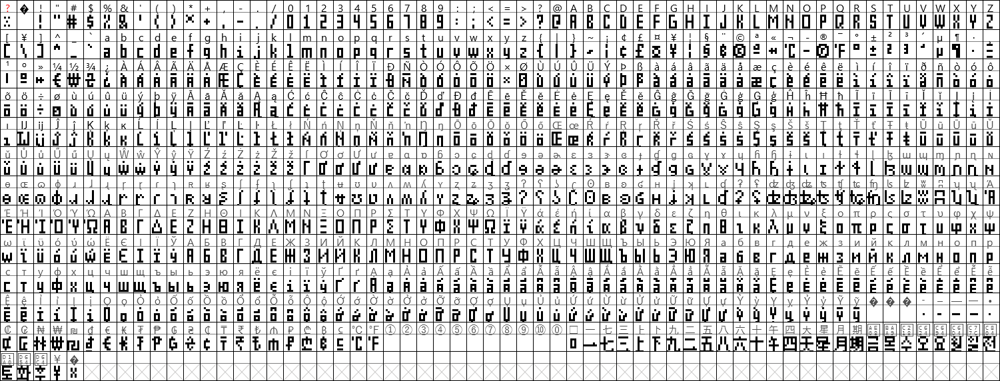
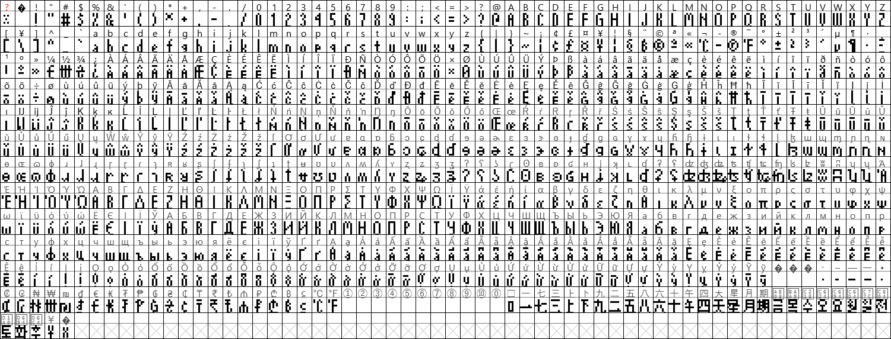

# Matrix Fonts
Fonts to be used with LED Matrix Clocks and other LED Matrix projects

## About These Fonts
These fonts are designed with LED Matrix Clocks in mind, especially a unit that uses [`EspHoMaTriXv2`](https://github.com/lubeda/EspHoMaTriXv2/) or [`EspHome-Led-PixelClock`](https://github.com/trip5/EspHome-Led-PixelClock/). They are BDF and TTF Fonts, so they can be directly implemented with ESPHome (and perhaps Arduino).

Because these are bitmap fonts, the size of these fonts is pixel-fixed. They are not resizable. This is a good thing.

Most characters will be 3 pixels wide, but certain characters like G and M and & are wider. Punctuation characters are generally 1 or 2 pixels wide. All characters have 1 empty column on the right side, except the space which is exactly 2 pixels, certain unicode hyphens, and perhaps some ognok-accented latin characters.

I will continue adding characters to fonts as I have time. If you wish your language to be a priority or if you need some certain characters added, open an issue and I'll see what I can do.

## 8-Series Fonts
*Suitable when using the full height of an 8-row matrix*

### MatrixChunky8
Everything big and blocky - looks great as a time screen



[ [BDF Download](https://powernukkit.github.io/DownGit/index.html#/home?directFile=1&url=https://github.com/trip5/Matrix-Fonts/blob/main/8-series/MatrixChunky8.bdf) | 
[TTF Download](https://powernukkit.github.io/DownGit/index.html#/home?directFile=1&url=https://github.com/trip5/Matrix-Fonts/blob/main/8-series/MatrixChunky8.ttf) ]

### MatrixChunky8X
Below the baseline is usually reserved for tails but with the 'X' fonts, there is no baseline - everything takes up the full 8 rows of pixels


[ [BDF Download](https://powernukkit.github.io/DownGit/index.html#/home?directFile=1&url=https://github.com/trip5/Matrix-Fonts/blob/main/8-series/MatrixChunky8X.bdf) | [TTF Download](https://powernukkit.github.io/DownGit/index.html#/home?directFile=1&url=https://github.com/trip5/Matrix-Fonts/blob/main/8-series/MatrixChunky8X.ttf) ]

### MatrixLight8
Most characters have been lightened and stylized


[ [BDF Download](https://powernukkit.github.io/DownGit/index.html#/home?directFile=1&url=https://github.com/trip5/Matrix-Fonts/blob/main/8-series/MatrixLight8.bdf) | [TTF Download](https://powernukkit.github.io/DownGit/index.html#/home?directFile=1&url=https://github.com/trip5/Matrix-Fonts/blob/main/8-series/MatrixLight8.ttf) ]

### MatrixLight8X
Lightened and stylized in 8 full rows - this one looks really good on info screens!



[ [BDF Download](https://powernukkit.github.io/DownGit/index.html#/home?directFile=1&url=https://github.com/trip5/Matrix-Fonts/blob/main/8-series/MatrixLight8X.bdf) | [TTF Download](https://powernukkit.github.io/DownGit/index.html#/home?directFile=1&url=https://github.com/trip5/Matrix-Fonts/blob/main/8-series/MatrixLight8X.ttf) ]


## 6-Series Fonts
*Suitable when using a weekday band underneath the time on an 8-row matrix*

Please note a lot of accented characters in the non-X fonts were pushed below the baseline to make them look slightly less terrible.

### MatrixChunky6
Everything big and blocky


[ [BDF Download](https://powernukkit.github.io/DownGit/index.html#/home?directFile=1&url=https://github.com/trip5/Matrix-Fonts/blob/main/6-series/MatrixChunky6.bdf) | [TTF Download](https://powernukkit.github.io/DownGit/index.html#/home?directFile=1&url=https://github.com/trip5/Matrix-Fonts/blob/main/6-series/MatrixChunky6.ttf) ]

### MatrixChunky6X
Big and blocky in 6 full rows


[ [BDF Download](https://powernukkit.github.io/DownGit/index.html#/home?directFile=1&url=https://github.com/trip5/Matrix-Fonts/blob/main/6-series/MatrixChunky6X.bdf) | [TTF Download](https://powernukkit.github.io/DownGit/index.html#/home?directFile=1&url=https://github.com/trip5/Matrix-Fonts/blob/main/6-series/MatrixChunky6X.ttf) ]

### MatrixLight6
Lightened and stylized


[ [BDF Download](https://powernukkit.github.io/DownGit/index.html#/home?directFile=1&url=https://github.com/trip5/Matrix-Fonts/blob/main/6-series/MatrixLight6.bdf) | [TTF Download](https://powernukkit.github.io/DownGit/index.html#/home?directFile=1&url=https://github.com/trip5/Matrix-Fonts/blob/main/6-series/MatrixLight6.ttf) ]

### MatrixLight6X
Lightened and stylized in 6 full rows


[ [BDF Download](https://powernukkit.github.io/DownGit/index.html#/home?directFile=1&url=https://github.com/trip5/Matrix-Fonts/blob/main/6-series/MatrixLight6X.bdf) | [TTF Download](https://powernukkit.github.io/DownGit/index.html#/home?directFile=1&url=https://github.com/trip5/Matrix-Fonts/blob/main/6-series/MatrixLight6X.ttf) ]

## Using These Fonts

### In ESPHome
To reduce the space that the font takes up during the compile please use code as such:
```
font: 
  - file: fonts/MatrixLight6.bdf
    id: special_font
    glyphs:  |
      ! "#$%&'()*+,-./0123456789:;<=>?@ABCDEFGHIJKLMNOPQRSTUVWXYZ[\]^_`abcdefghijklmnopqrstuvwxyz°
```

If using a TTF file, you must specify the font size:
```
font: 
  - file: fonts/MatrixLight8.ttf
    id: default_font
    glyphs:  |
      ! "#$%&'()*+,-./0123456789:;<=>?@ABCDEFGHIJKLMNOPQRSTUVWXYZ[\]^_`abcdefghijklmnopqrstuvwxyz°
    size: 8
```

## Characters Included

### Latin-1

#### Basic Latin
```
! "#$%&'()*+,-./0123456789:;<=>?@ABCDEFGHIJKLMNOPQRSTUVWXYZ[\]^_`abcdefghijklmnopqrstuvwxyz{|}~
```

#### Latin Extended-A
```
¡¢£¤¦§©ª«®°±²³´µ¶¥·¹º»¿ÀÁÂÃÄÅÆÇÈÉÊËÌÍÎÏÐÑÒÓÔÕÖ×ØÙÚÛÜÝÞßàáâãäåæçèéêëìíîïðñòóôõö÷øùúûüýþÿ
```

##### Character Substitutions in Latin Extended-A
Because of the BDF-Pillow flaw (see below), I made a few "useless" characters in the Latin Extended-A look like something else. You can still use a BDF file if you use these special characters in the glyphs list and in Home Assistant.
```
¨¬¯¸¼½¾
```
| Character | Appears As  |
| --------- | ----------- |
| `¨`       | ₿ Bitcoin   |
| `¸`       | Ξ Ethereum  |
| `¬`       | ℃ Degree C |
| `¯`       | ℉ Degree F |
| `¼`       | € Euro      |
| `½`       | ₩ Won       |
| `¾`       | ₴ Hryvnia   |

### Unicode

#### Latin-1 Supplement

```
ĀāĂ㥹ĆćĈĉĊċČčĎďĐđĒēĔĕĖėĘęĚěĜĝĞğĠġĢģĤĥĦħĨĩĪīĬĭĮįİıIJijĴĵĶķĸĹĺĻļĽľĿŀŁłŃńŅņŇňʼnŊŋŌōŎŏŐőŒœŔŕŖŗŘřŚśŜŝŞşŠšŢţŤťŦŧŨũŪūŬŭŮůŰűŲųŴŵŶŷŸŹźŻżŽžſ
```

#### Cyrillic
```
АаБбВвГ㥴ДдЕеЄєЖжЗзИиІіЇїЙйКкЛлМмНнОоПпРрСсТтУуФфХхЦцЧчШшЩщЬьЮюЯя
```

#### Greek * Only in 8-series Fonts

```
ΑΒΓΔΕΖΗΘΙΚΛΜΝΞΟΠΡΤΥΦΧΨΩΆΈΉΊΌΎΏΪΫαβγδεζηθικλμνξοπρςστυφχψωάέήίϊϋόύώ
```
Note these have not been eye-tested by an actual Greek person.  Please let me know if they're okay!

#### Korean (only useful for time and date display) * Only in 8-series Fonts
```
오후전일월화수목금토요
```

#### Chinese (only useful for time and date display) * Only in 8-series Fonts
```
一二三四五六天七八九十星期月上下午
```
Note that 上下午 are squished a bit to allow display of 上午 & 下午 more easily.

#### General Punctuation

##### Spaces
The regular space (as available on most keyboards) is 2 pixels wide. Here are some other available spaces.

```
   
```

| Space   | Name       | Unicode | Width    |
| ------- | ---------- | ------- |--------- |
| ` `     | Thin Space | U+2009  | 1 pixel  |
| ` `     | En Space   | U+2002  | 3 pixels |
| ` `     | Em Space   | U+2003  | 4 pixels |

##### Pixel Spaces (that can be used as characters)
In case those spaces are no use to you (they're invisible and ESPHome will likely treat them as spaces), here are some other available spaces using the Unicode encircled number set.

```
⓪①②③④⑤⑥⑦⑧⑨⑩
```

| Space   | Name       | Unicode | Space Width |
| ------- | ---------- | ------- |------------ |
| `⓪`     | Circled 0  | U+24EA  | 0 pixels    |
| `①`     | Circled 1  | U+2460  | 1 pixel     |
| `②`     | Circled 2  | U+2461  | 2 pixels    |
| `③`     | Circled 3  | U+2462  | 3 pixels    |
| `④`     | Circled 4  | U+2463  | 4 pixels    |
| `⑤`     | Circled 5  | U+2464  | 5 pixels    |
| `⑥`     | Circled 6  | U+2465  | 6 pixels    |
| `⑦`     | Circled 7  | U+2466  | 7 pixels    |
| `⑧`     | Circled 8  | U+2467  | 8 pixels    |
| `⑨`     | Circled 9  | U+2468  | 9 pixels    |
| `⑩`     | Circled 10 | U+2469  | 10 pixels   |


##### Other Punctuation Marks
The regular hypen-minus (as available on most keyboards) is 3 pixels wide plus a space.  Here are some other available punctuations.

```
‐–—―•
```

| Mark    | Name           | Unicode | Width                  |
| ------- | -------------- | ------- |----------------------- |
| `‐`     | Hypen          | U+2010  | 1 pixel wide, no space |
| `–`     | En Hypen       | U+2013  | 2 pixels wide + space  |
| `—`     | Em Hyphen      | U+2014  | 4 pixels wide + space  |
| `―`     | Horizontal Bar | U+2015  | 4 pixels wide, no space|
| `•`     | Bullet         | U+2022  | 1 pixel wide + space   |

#### Currency Symbols
```
₡₢₦₩₪₫€₭₮₱₲₴₵₸₹₺₼₽₾₿
```

#### Letterlike Symbols
```
℃℉
```

## ESPHome Notes
Any characters included in the glyphs list that are not actually in the font will cause ESPHome to error when compiling.  Any character requested not included in the glyphs list should result in an error and/or a block or blank being displayed by your clock.

Also note that there is a limit of 256 characters that can be used. This is a hard limit set by Pillow, a python dependency that converts fonts to bitmaps usable by ESPHome. If your glyphs list is longer, any characters beyond that limit will simply not be displayed.

### Unicode Character Error
```
UnicodeEncodeError: 'latin-1' codec can't encode character '\u0416' in position 0: ordinal not in range(256)
```

This error has to do with the way that Pillow interprets a BDF font file as being in the Latin-1 codepage if the character list doesn't match what it expects. Since that part of Pillow is quite old, there seems to be no interest in fixing it to match UTF standards. So, if you wish to use Unicode characters (anything outside of Latin Basic and Extended-A), you must use a TTF file instead.

These TTF files are not usable by Windows, since they include only bitmaps. They are also not very useful when editing the font. So the BDF files will always be considered as master files.


## EspHoMaTriXv2
When using EspHoMaTriX, check that this is in your yaml (edit as needed):
```
ehmtxv2:
  default_font_id: default_font
  default_font_yoffset: 6
  special_font_id: special_font
  special_font_yoffset: 8
```

Please note that yoffset can be tricky.  You should use a number that corresponds with the baseline of the font. For these fonts, there is actually nothing below the font baseline; I've designed the fonts so the non-X fonts are actually raised 1 pixel above the baseline so the tails appear correctly.

## Editing or Contributing
If you wish a character set to be added, open an issue, make a request! Please keep your communication lines open because I'm not likely familiar with your language and I'll have questions!

Check out FontForge: https://fontforge.org/en-US/

### Thanks to...
[`Andrew J.Swan`](https://github.com/andrewjswan) for huge help with Cyrillic characters.

### Inspiration
Originally, I used Tom Thumb as a base. There may be still be some resemblance but that's just because there's only so much you can do with such limited pixels.  Nevertheless, if you're interested in a 4x6 (3x5 useable) monospaced font you can [click here](https://robey.lag.net/2010/01/23/tiny-monospace-font.html).

Also, some inspiration for the Korean characters was borrowed from [Dalmoori Font](https://ranolp.github.io/dalmoori-font/), a very nice Hangul pixel font.

The Chinese characters are almost 100% copied from [Boutique Bitmap 7x7 Font](https://github.com/scott0107000/BoutiqueBitmap7x7/), a Chinese pixel font and stretched a bit in the X-series.
